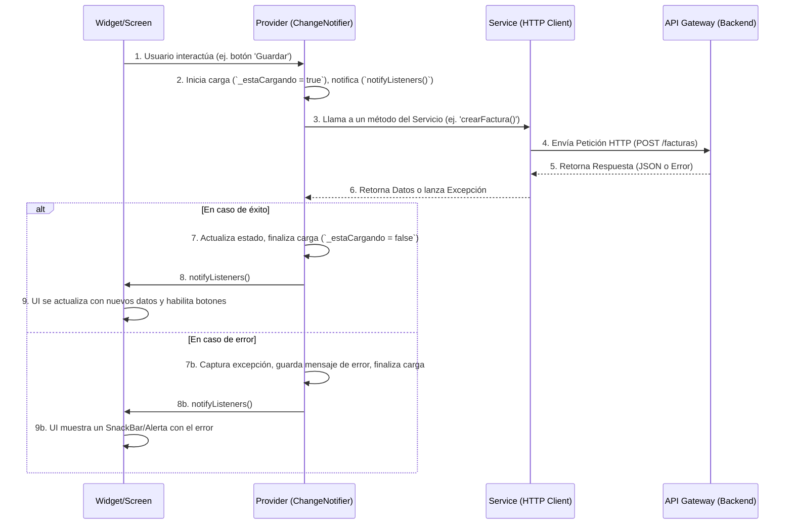

# 02: Gestión de Estado y Flujo de Datos en Factura SAT Móvil (facturamovilapp)

## 1. Patrón de Gestión de Estado: `Provider`

La aplicación `facturamovilapp` utiliza la librería `provider` como su patrón principal para la gestión de estado y la inyección de dependencias. `Provider` es una solución flexible y escalable que se integra bien con el paradigma declarativo de Flutter, permitiendo que los widgets accedan a datos y servicios de forma eficiente y reactiva.

### Razones para su Elección:
*   **Simplicidad:** Es relativamente fácil de aprender y usar para la mayoría de los casos de uso de gestión de estado.
*   **Eficiencia:** Permite la reconstrucción selectiva de widgets, optimizando el rendimiento al solo reconstruir las partes de la UI que realmente necesitan actualizarse.
*   **Separación de Intereses:** Facilita la separación de la lógica de negocio (en `ChangeNotifier`s) de la capa de UI (Widgets).
*   **Acceso a Dependencias:** Simplifica la inyección de servicios, modelos de estado y otros objetos en el árbol de widgets.

### Tipos de `Provider` Utilizados:
El tipo más predominante de `Provider` utilizado en `facturamovilapp` es `ChangeNotifierProvider`, que debe ser el estándar para gestionar estados de UI complejos o que cambian en respuesta a múltiples eventos.

*   **`ChangeNotifierProvider`:** Se utiliza para exponer una instancia de `ChangeNotifier` a los descendientes en el árbol de widgets. Cuando el `ChangeNotifier` notifica a sus `listeners` (`notifyListeners()`), los widgets que lo "escuchan" se reconstruyen.
    *   **Uso Común:** Se encuentra extensamente en `lib/providers/` donde cada archivo (ej. `proveedor_autenticacion.dart`, `proveedor_factura.dart`) extiende `ChangeNotifier` y gestiona un fragmento específico del estado de la aplicación.
    *   **Ejemplo de Implementación (Real del Proyecto):**
        ```dart
        // lib/providers/proveedor_autenticacion.dart
        import 'package:flutter/material.dart';

        class ProveedorAutenticacion extends ChangeNotifier {
          bool _estaCargando = false;
          bool get estaCargando => _estaCargando;

          // El resto de la lógica del provider...

          Future<String?> iniciarSesion() async {
            _estaCargando = true;
            notifyListeners(); // Notifica a la UI que la carga ha comenzado

            final servicioAutenticacion = ServicioAutenticacion();

            try {
              await servicioAutenticacion.iniciarSesion(userRfc, userPass, _usoBiometricos);
              
              // Lógica de éxito...
              _estaCargando = false;
              notifyListeners(); // Notifica que la carga ha terminado
              return null; // Retorna null en caso de éxito
            } catch (exc) {
              _estaCargando = false;
              notifyListeners(); // Notifica que la carga ha terminado
              return exc.toString(); // Retorna el mensaje de error
            }
          }
        }

        // En lib/main.dart, se provee de forma global
        MultiProvider(
          providers: [
            ChangeNotifierProvider(create: (_) => ProveedorAutenticacion()),
            // ... otros providers
          ],
          child: const FacMovApp(),
        )

        // En un widget de la UI (ej. pantalla_autenticacion.dart)
        final provAutenticacion = Provider.of<ProveedorAutenticacion>(context);

        ElevatedButton(
          onPressed: provAutenticacion.estaCargando ? null : () async {
            final errorMsj = await provAutenticacion.iniciarSesion();
            if (errorMsj == null) {
              // Navegar a la siguiente pantalla
            } else {
              // Mostrar SnackBar con el error
              ServicioNotificacion.mostrarSnackBar(errorMsj);
            }
          },
          child: const Text('Iniciar Sesión'),
        )
        ```
*   **`FutureProvider` y `StreamProvider`:** Utilizar estos providers cuando un widget solo necesite consumir el resultado de un `Future` o un `Stream` único y no requiera una lógica de negocio compleja o la capacidad de mutar el estado desde la UI. Son más eficientes para casos de solo lectura.

## 2. Diagrama de Flujo de Datos Típico

El flujo de datos en `facturamovilapp` sigue un ciclo predecible basado en el patrón `Provider`, donde la UI desencadena acciones que modifican el estado, el cual a su vez actualiza la UI de forma reactiva. A continuación, se ilustra un flujo típico de interacción:



**Descripción del Flujo:**
1.  **Interacción del Usuario:** Un `Widget` o `Screen` captura una acción del usuario.
2.  **Llamada al `Provider`:** La UI invoca un método en una instancia de `Provider` (un `ChangeNotifier`).
3.  **Inicio de Carga:** El `Provider` actualiza su estado interno para reflejar que una operación está en curso (ej. `_estaCargando = true;`) e invoca `notifyListeners()` inmediatamente para que la UI pueda mostrar un indicador de carga y deshabilitar botones.
4.  **Llamada al `Service`:** El `Provider` llama a un método asíncrono en una clase `Service`.
5.  **Comunicación con el Backend:** El `Service` realiza la petición HTTP.
6.  **Manejo de Respuesta:** El `Service` procesa la respuesta. Si es exitosa, devuelve los datos. Si falla, lanza una excepción (`throw Exception('Error')`).
7.  **Actualización de Estado (Éxito o Error):** Dentro de un bloque `try-catch`, el `Provider` maneja el resultado.
    *   **`try`**: Si la llamada es exitosa, actualiza el estado con los nuevos datos.
    *   **`catch`**: Si se captura una excepción, almacena el mensaje de error.
8.  **Fin de Carga y Notificación:** En ambos casos (`try` o `catch`), el `Provider` actualiza su estado para indicar que la operación ha terminado (ej. `_estaCargando = false;`) y llama a `notifyListeners()` para informar a la UI.
9.  **Reconstrucción de UI:** Los `Widgets` afectados se reconstruyen para reflejar el estado final, ya sea mostrando los nuevos datos o presentando un mensaje de error al usuario.

## 3. Patrones de Estado y Formularios

### Patrón para Estado de Carga y Error
Para mantener la consistencia, todos los `Providers` que realicen operaciones asíncronas deben implementar el siguiente patrón:
*   **Una propiedad de carga:** `bool _estaCargando = false;` con su respectivo `getter`.
*   **Estado en el `Provider`:** La lógica para modificar `_estaCargando` debe residir **exclusivamente** dentro del `Provider`. La UI nunca debe modificar este estado directamente.
*   **Retorno de Errores:** Los métodos asíncronos en los `Providers` deben retornar `Future<String?>`. Devolverán `null` si la operación fue exitosa, o un `String` con el mensaje de error si falló.

### Patrón para Gestión de Formularios
*   **`GlobalKey`:** La gestión y validación de formularios se realiza utilizando un `GlobalKey<FormState>` definido dentro del `Provider` asociado a la pantalla.
*   **Validación:** La UI invoca el método de validación del `Provider` (ej. `esFormularioValido()`), que a su vez usa `llaveFormulario.currentState?.validate() ?? false;`.

## 4. Guía para la Creación y Alcance de `Providers`

*   **Responsabilidad Única:** Cada `Provider` debe tener una única responsabilidad bien definida. Por ejemplo, `ProveedorAutenticacion` gestiona el inicio y cierre de sesión.
*   **Cohesión de Dominio:** Agrupar en un mismo `Provider` la lógica y el estado que están conceptualmente relacionados.
*   **Alcance Global vs. Local:**
    *   **Global (`MultiProvider` en `main.dart`):** Los `Providers` cuyo estado es necesario en múltiples partes no relacionadas de la aplicación (ej. `ProveedorAutenticacion`, `ProveedorConfiguracion`) deben ser declarados en la lista centralizada de `main.dart`.
    *   **Local (Acotado a una ruta):** Si un `Provider` solo es necesario para una pantalla específica y sus descendientes (ej. un `Provider` para un formulario complejo de múltiples pasos), debe ser declarado en el widget padre de esa ruta para que sea desechado cuando el usuario abandone esa sección de la app.
*   **`Consumer` vs. `Selector`:** Utilizar `Selector` cuando solo se necesita reconstruir un widget cuando una *parte específica* del estado del `Provider` cambia. Utilizar `Consumer` cuando el widget necesita acceder a *todo* el `Provider` y reconstruirse ante *cualquier* cambio.
*   **Inyección de Dependencias Limpia:** Inyectar otros `providers` o servicios en un `Provider` principal solo cuando sea estrictamente necesario, utilizando `Provider.of<T>(context, listen: false)` o el patrón `ProxyProvider` para manejar dependencias entre `providers`.
*   **Inmutabilidad (cuando sea posible):** Aunque `ChangeNotifier` implica estado mutable, se debe buscar la inmutabilidad para los modelos de datos que expone un `Provider`. Esto significa que, al actualizar un objeto complejo dentro de un `Provider`, se debe crear una nueva instancia del objeto con los datos modificados, en lugar de mutar directamente el objeto existente. Esto ayuda a prevenir efectos secundarios no deseados y mejora la reactividad. 