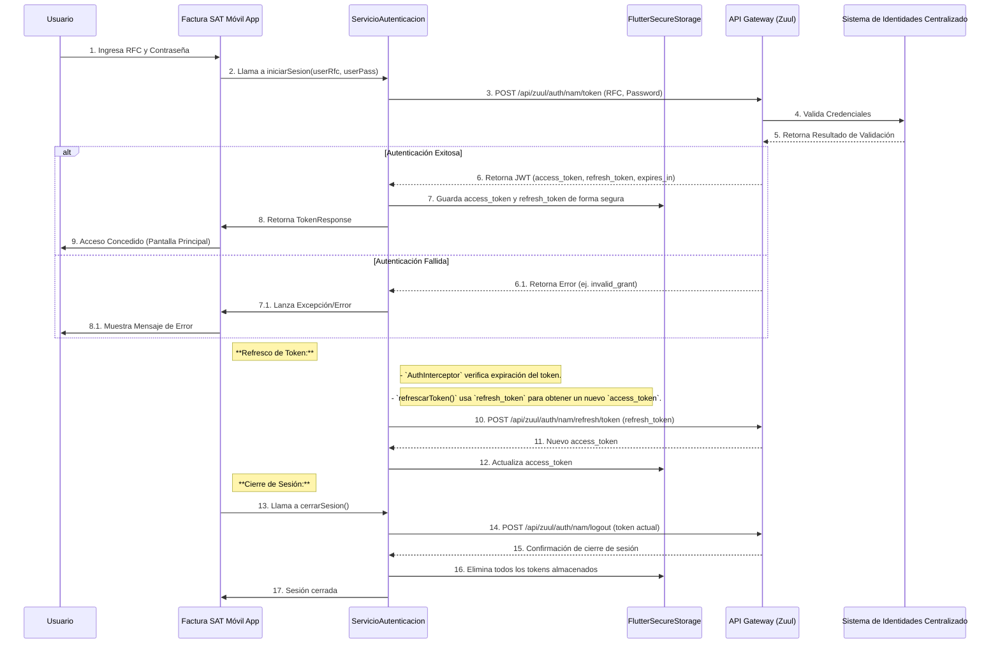

# 03: Comunicación con la API y Seguridad en el Cliente (facturamovilapp)

Este documento detalla cómo la aplicación `facturamovilapp` interactúa con los servicios de backend y las medidas de seguridad implementadas en el lado del cliente para proteger la información y la integridad de las operaciones.

## 1. Contrato con el Backend (API Gateway)

Todas las comunicaciones de la aplicación `facturamovilapp` con los microservicios de backend se realizan a través de un **API Gateway**, que actúa como un punto de entrada unificado y una capa de seguridad. En este caso, el API Gateway es un componente de Spring Cloud (Zuul) en el backend.

*   **URL Base del API Gateway:**
    *   Host: `zuul-fac-movil.cnh.uat.cloudb.sat.gob.mx` (definido en `lib/global/ambiente.dart` como `baseUrlZuul`)
*   **Endpoints Principales (Prefijos de API):**
    *   `api/facmovil/` (definido en `lib/global/ambiente.dart` como `baseApiFacMovil`): Para la lógica de negocio principal de facturación.
    *   `api/catalogos/` (definido en `lib/global/ambiente.dart` como `baseApiCatalogos`): Para la consulta de catálogos generales.
*   **Formato de Peticiones y Respuestas:**
    *   **Formato:** JSON (JavaScript Object Notation).
    *   **Codificación:** UTF-8.
    *   **Estructura de Errores:** Se espera un formato estándar para los mensajes de error (`error` y `error_description` en `TokenResponse` o mensajes de error personalizados en `UtileriaMensajes`).

## 2. Flujo de Autenticación JWT

La autenticación de usuarios en `facturamovilapp` se gestiona mediante tokens JWT (JSON Web Tokens) emitidos por el API Gateway tras una validación exitosa contra el Sistema de Identidades Centralizado (IdC) del SAT. El proceso sigue los siguientes pasos:

### Almacenamiento Seguro de Tokens:
*   La aplicación utiliza `flutter_secure_storage` para almacenar el `access_token` y el `refresh_token` de forma segura. Esta librería utiliza mecanismos específicos del sistema operativo (KeyChain en iOS/macOS, Keystore en Android) para cifrar y proteger la información sensible.

## 3. Manejo de Peticiones HTTP e Interceptores

La librería `http` de Dart es la base para las peticiones HTTP. Un componente clave en este proceso es `AuthInterceptor`.

*   **Librería HTTP:** Se utiliza `package:http/http.dart` para realizar todas las llamadas a la API.
*   **`AuthInterceptor`:**
    *   Es un `http.BaseClient` personalizado que intercepta cada petición saliente.
    *   **Propósito Principal:** Inyectar automáticamente el `Bearer Token` (JWT) en la cabecera `Authorization` de todas las peticiones, excepto aquellas dirigidas a los endpoints de autenticación (`/auth/nam/`).
    *   **Manejo de Refresco de Token:** Antes de enviar una petición, el interceptor verifica si el token en memoria ha expirado (`JwtDecoder.isExpired`). Si es así, intenta refrescarlo utilizando el `refreshToken` a través de `ServicioAutenticacion().refrescarToken()`. Esto asegura que las peticiones se envíen con un token válido y reduce la probabilidad de errores 403 Forbidden.
    *   **Manejo de `Content-Type`:** También asegura que la cabecera `Content-Type` sea `application/json; charset=UTF-8` para las peticiones JSON.

## 4. Seguridad en el Cliente (Dispositivo)

Además de la gestión de tokens, la aplicación implementa otras medidas de seguridad en el dispositivo:

*   **Autenticación Biométrica (`local_auth`):**
    *   La aplicación integra `local_auth` para permitir a los usuarios autenticarse utilizando sus credenciales biométricas (Face ID, Touch ID, huella dactilar) si el dispositivo lo soporta y el usuario lo ha habilitado.
    *   Esto mejora la conveniencia y seguridad del acceso a la aplicación sin necesidad de reintroducir constantemente la contraseña.
*   **Ofuscación de Código (R8/ProGuard):**
    *   Para las compilaciones de `release` en Android, Flutter utiliza por defecto **R8** (un reemplazo de ProGuard) para la minificación y ofuscación del código. Esto reduce el tamaño de la aplicación y dificulta la ingeniería inversa del código compilado, añadiendo una capa de seguridad contra el análisis estático no autorizado.
    *   Aunque `android/app/build.gradle.kts` no contenga explícitamente las líneas `minifyEnabled` o `proguardFiles`, R8 se activa por defecto para las builds de release en Flutter. Es una buena práctica verificar las configuraciones específicas en futuras auditorías de seguridad. 