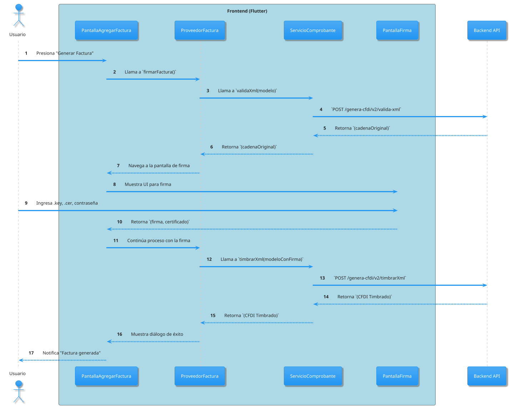
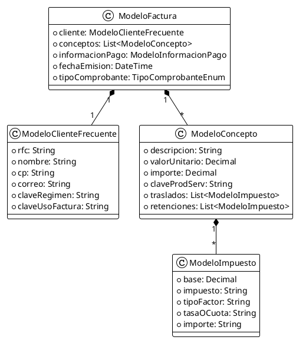
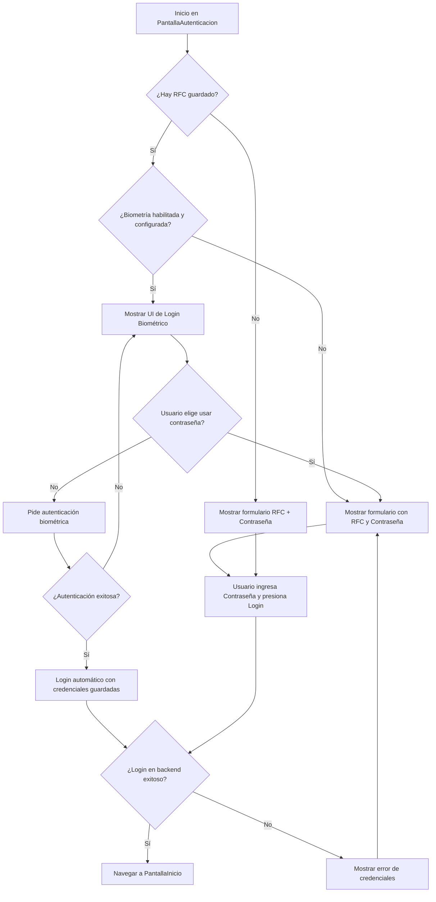

# Diagramas de Arquitectura: MVP de Factura Móvil

Este documento contiene una serie de diagramas generados con PlantUML y Mermaid que visualizan la arquitectura y los flujos de datos de la implementación actual del MVP, basándose en los hallazgos del documento de auditoría `.raise/docs/auditoria_mvp_existente.md`.

## 1. Diagrama de Componentes de Alto Nivel (PlantUML)

Este diagrama ilustra la arquitectura por capas de la aplicación, mostrando cómo los componentes principales interactúan entre sí, desde la interfaz de usuario hasta el backend.

```plantuml
@startuml
!theme spacelab

package "Factura Móvil App (Flutter)" {
  !define ICONURL https://raw.githubusercontent.com/tupadr3/plantuml-icon-font-sprites/v2.4.0
  !includeurl ICONURL/common.puml
  !includeurl ICONURL/devicons/flutter.puml
  !includeurl ICONURL/devicons/database.puml
  !includeurl ICONURL/font-awesome-5/server.puml
  !includeurl ICONURL/font-awesome-5/user_lock.puml

  rectangle "UI (Screens & Widgets)" as UI <<DEV_FLUTTER>>
  rectangle "State Management (Providers)" as Providers
  rectangle "Business Logic (Services)" as Services
  rectangle "Data Models" as Models

  UI --> Providers : "Observa y llama a métodos"
  Providers ..> Models : "Gestiona estado de"
  Providers --> Services : "Delega lógica de negocio"
  Services ..> Models : "Usa como DTOs"
}

cloud "Backend API" as Backend <<FA5_SERVER>>
database "Secure Storage" as SecureStorage <<DEV_DATABASE>>
actor "Usuario" as User

User -> UI : "Interactúa"
Services -> Backend : "Llamadas HTTP (REST)"
Services -> SecureStorage : "Guarda/Lee Tokens"

@enduml
```

---

## 2. Diagrama de Secuencia: Generación y Timbrado de Factura (PlantUML)

Este diagrama detalla el flujo de interacciones dinámicas que ocurren cuando un usuario genera y timbra una nueva factura. Muestra la orquestación entre la UI, los proveedores, los servicios y el backend.



---

## 3. Diagrama de Clases: Modelos de Datos Principales (PlantUML)

Este diagrama muestra la estructura de los modelos de datos más importantes de la aplicación y sus relaciones.



---

## 4. Diagrama de Flujo: Autenticación de Usuario (Mermaid)

Este diagrama de flujo describe el proceso de decisión que sigue la aplicación para autenticar a un usuario, incluyendo la opción de biometría.

