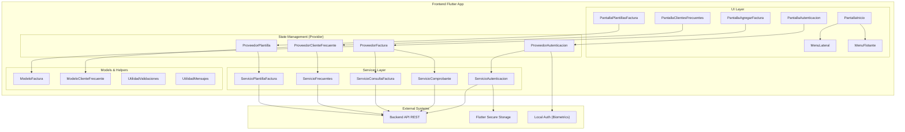
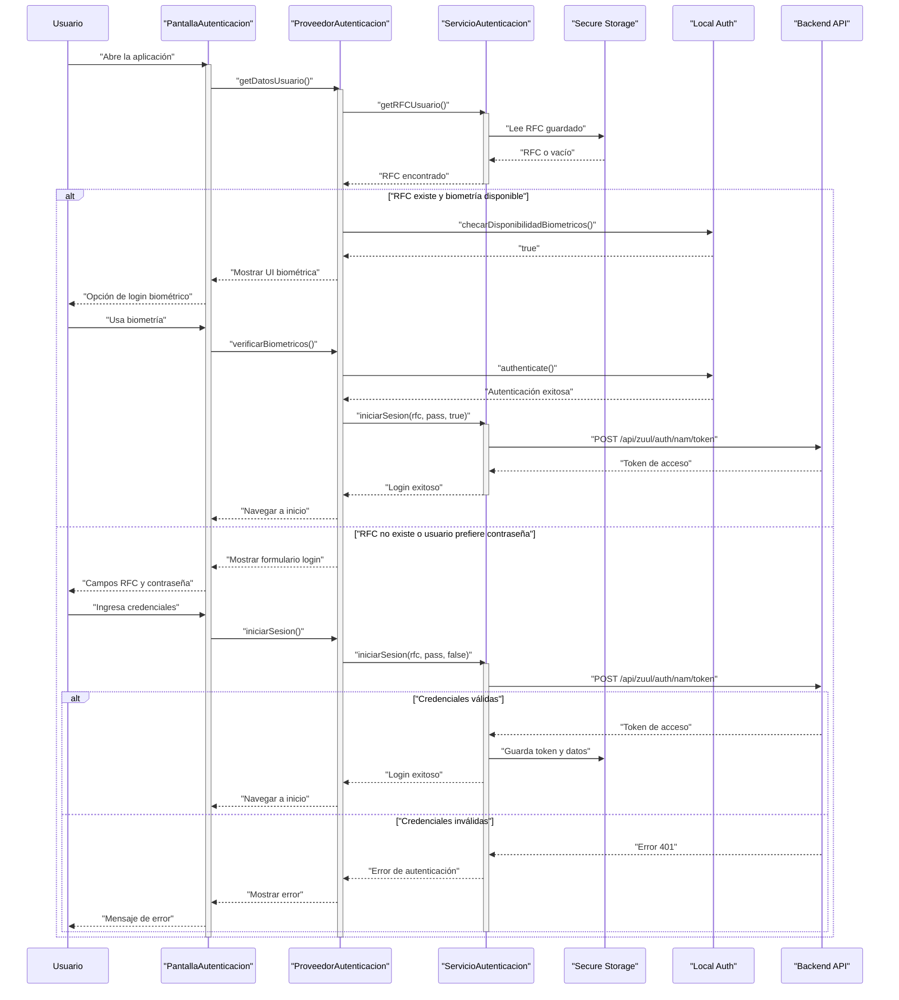
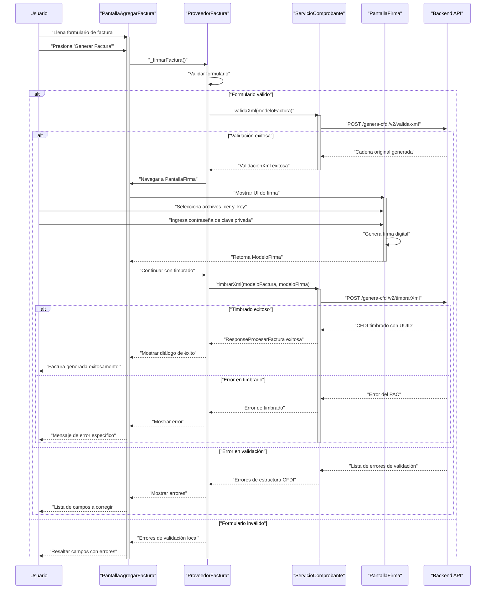
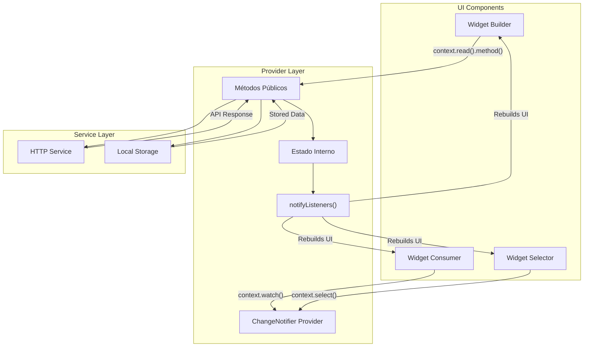
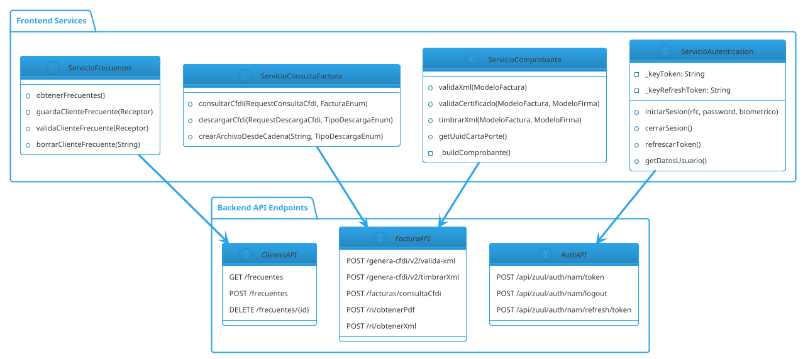
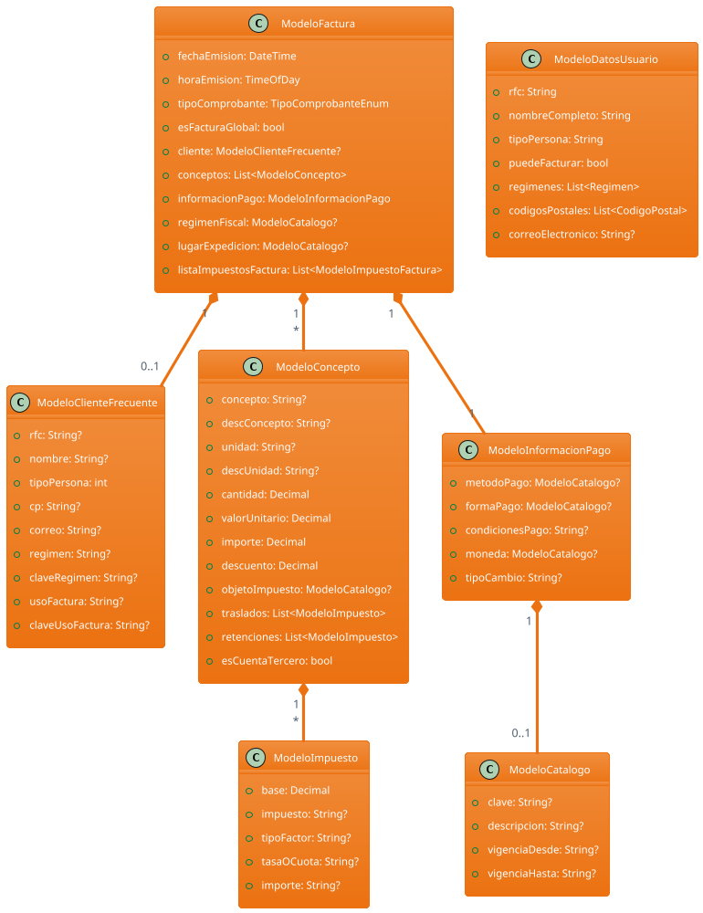
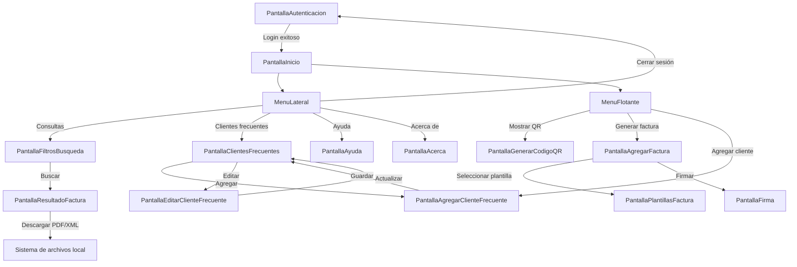
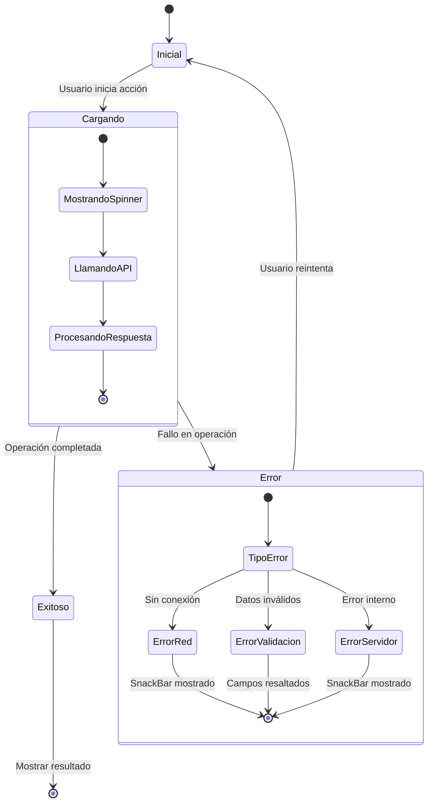

# Diagramas de Arquitectura Detallados: MVP de Factura Móvil

Este documento contiene diagramas técnicos detallados basados en los hallazgos del análisis de implementación del MVP. Los diagramas Mermaid siguen estrictamente las reglas de `@aaa-generacion-mermaid.mdc`.

## 1. Arquitectura General del Sistema (Mermaid)

Este diagrama muestra la arquitectura por capas y las relaciones entre los componentes principales identificados en la auditoría.

## 2. Flujo de Autenticación Completo (Mermaid)

Diagrama de secuencia que muestra el flujo completo de autenticación, incluyendo biometría y manejo de errores.

## 3. Flujo de Generación de Factura (Mermaid)

Diagrama que detalla el proceso completo de creación y timbrado de una factura.

## 4. Gestión de Estado con Provider (Mermaid)

Diagrama que ilustra cómo fluye el estado en la aplicación usando el patrón Provider.

## 5. Arquitectura de Servicios y API (PlantUML)

Diagrama que muestra la organización de servicios y su comunicación con el backend.

## 6. Modelo de Datos Completo (PlantUML)

Diagrama de clases que muestra la estructura completa de los modelos principales y sus relaciones.

## 7. Flujo de Navegación de la Aplicación (Mermaid)

Diagrama que muestra las rutas y la navegación entre pantallas principales.

## 8. Manejo de Errores y Estados de Carga (Mermaid)

Diagrama que ilustra cómo se manejan los diferentes estados de la aplicación.

